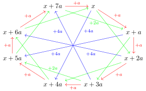

# JuniorFeistel
In this challenge we are tasked with performing a chosen-plaintext key-recovery attack on a custom 64-bit block cipher. The attack has a data limit of 7 million plaintext-ciphertext pairs and a time limit of 10 minutes. The custom block cipher is a Feistel network that uses modular addition instead of XOR to add the branches together. Additionally, the round function is non-invertible. A single round (out of 10) looks as follows:

<picture>
  <source media="(prefers-color-scheme: dark)" srcset="figures/1_round_dark.svg">
  <source media="(prefers-color-scheme: light)" srcset="figures/1_round.svg">
  
</picture>

The round function $F_i$ is a doozy, it looks something like this:
$$F_i(x, k) = (3\boxdot\rho_{19}(k\boxplus x))\oplus (5\boxdot\rho_{3}(k\boxminus x)) \oplus (k \boxplus (i \boxdot {\tt 13371337_x}))$$
where $\boxdot,\boxplus,\boxminus$ are respectively multiplication, addition and subtraction in the ring of integers modulo $2^{32}$ and $\rho_i$ is the bit rotation to the left by $i$ bits. Spoiler for later, I will just use this as a black box and never come back to it.

The key schedule that generates the round keys $K_i$ from a 64 bit master key uses the same Feistel rounds but with round constants instead of round keys. The round keys are the left branch of the input to every round of the key schedule. Since the key schedule is reversible, the master key can easily be recovered from two sequential round keys.

In the rest of this write-up I will document my key recovery attack. It follows the standard 3-step framework of
1) find a distinguisher
2) recover the round key(s) of the last round(s) and
3) brute force the rest of the master key.

In the first section I will discuss the process of finding the distinguisher, which in this case will be through differential cryptanalysis. In the second section I will discuss how we can get the most out of the data limit by using input structures to combine multiple differential distinguishers. The third section will be about the key recovery itself. Finally, I will finish with some thoughts on the challenge.

## 1. Finding a distinguisher
The easiest (to implement) attack avenues for a block cipher are probably SMT modelling, MitM attacks or integral attacks, since all of these attacks are deterministic. However, due to the relatively large number of rounds, the complexity of the round function, the use of modular addition and the low data limit, non of these avenues are viable. Given the modular addition and rotations, it would be cool to use rotational(-xor) cryptanalysis, alas, due to the key addition, this is only applicable in the related-key setting. The next best things are probably differential or linear cryptanalysis. Lets focus on the former.

### Differential cryptanalysis
The idea behind differential cryptanalysis is to propagate a pair of values with a know difference through the block cipher and evaluate the probability that you see another predetermined difference at the output. The reason that this is so useful, is because a difference deterministically propagates through the principal component of any block cipher: the key addition. With addition we mean the group operation of an Abelian group, think bit-vectors with xor or addition modulo an integer. Given a known difference $a$ in the group and an unknown key $k$, the pair $(x, x+a)$ evaluates to $\left((x+k), (x+k)+a\right)$ over the key addition. Even though the value of the pair is now unknown, the difference between the two values is still $a$. In this case, we say that the difference $a$ propagates to $a$ deterministically.

In general, only linear functions will have deterministic difference propagation. For example, the copy function $x \mapsto (x, x)$ propagates difference $a$ to difference $(a, a)$ and the addition of two values $(x, y) \mapsto x+y$ propagates difference $(a, b)$ to difference $a+b$. For nonlinear functions, the situations becomes more complicated. A single difference could propagate to many other differences, but each propagation has a smaller than one probability of occurring. However, one propagation always has probability one, the zero to zero difference. Additionally, when the non-linear function is a permutation, the zero input difference is the only difference that propagates to the zero output difference. As an example, consider the AND of two bits. When the input difference is (0, 0), then the output difference can only be $0$. However, any other input difference propagates with probability $1/2$ to both the $0$ and $1$ output difference.

To approximate the probability of a difference propagation through a complex function, like a block cipher, we can start from a chosen input difference an propagate it forwards through every component of the cipher. The input and output difference, together with all the intermediate differences are called a *differential characteristic*. The product of the probabilities of all the transition in the characteristic is then, under Markov assumptions, a lower bound on the key-averaged probability of the differential over the whole cipher. I'll discuss what that means in the last section of this write-up, but in non-extreme cases (such as ours), it means that the probability of the characteristic is a reasonable approximation of the actual probability of the differential.

Before we continue to the search for a trail, in the rest of this write-up we will be using differential cryptanalysis with the group $\langle\mathbb{Z}_{2^{32}}, + \rangle$.

### Differential characteristic
If the round function of a Feistel network is non-invertible there is a good repeatable 2-round meta-characteristic that allows us to skip every second round function. Instantiating it with a specific difference should give us a reasonably high probability differential.

<picture>
  <source media="(prefers-color-scheme: dark)" srcset="figures/two_round_meta_characteristic_dark.svg">
  <source media="(prefers-color-scheme: light)" srcset="figures/two_round_meta_characteristic.svg">
  
</picture>

To instantiate this trail, we have to look for a difference such that the propagation of $a$ to $0$ is of high probability. To do this, I just stared to enumerate all differences from $1$ to $2^{32}-1$ with 1000 samples for random keys and gave up once I found something reasonable. The first reasonable difference I found was ${\tt 00010001_x}$, which had a probability of $> 2^{-7}$ if I recall correctly. Then, I tested all 16 rotations of this differences and found 3 difference with probability slightly under $2^{-5}$: ${\tt 04000400_x}$, ${\tt 08000800_x}$ and ${\tt 10001000_x}$. By repeating the above meta-characteristic 4.5 times and instantiating $a$ with any of these three differences results in a nine round characteristic with probability somewhat under $2^{-20}$, which is usable for an attack. In fact, we can even get a ten round truncated differential distinguisher by only looking at the left branch of the output, on which the difference is $a$ with the same probability.

## 2. Maximizing the number of input pairs
Ordinarily, differential cryptanalysis is performed over the group $\mathbb{F}_2^n$ with the element-wise addition. In this setting there is a trick to combine multiple differential properties with linearly independent input differences without increasing the data complexity. Say you have two input differences, $a$ and $b$. To sample the input pair $(x, x+a)$ for some $x$ once, you have to perform two encryption queries. However, you can get two extra input pairs with difference $b$ with only two extra encryption queries, namely $(x, x+b)$ and $(x+a, (x+a)+b)$. Additionally, you now also have the pair $(x+b, (x+b)+a)$. So you get a buy two, get two free deal. This deal gets better the more properties you combine, as in general, for $n$ linearly independent input differences, you get $n$ times $2^{n-1}$ input pairs for $2^n$ queries. This trick is called an *input structure*. Below is a visual representation of an input structure with $3$ linearly independent input differences. The nodes are the queries and the edges are the input pairs.

<picture>
  <source media="(prefers-color-scheme: dark)" srcset="figures/simple_input_structure_dark.svg">
  <source media="(prefers-color-scheme: light)" srcset="figures/simple_input_structure.svg">
  
</picture>

We can apply a similar trick to differential cryptanalysis over the group we are working in. Even more so, we can construct an input structure with a single difference, because unlike in the bit vector case, most group elements are not their own inverse. That is, we can use pairs of the form $(x+i\cdot a, x+(i+1)\cdot a)$ for i from 0 to $\textrm{ord}(a)$ where $\textrm{ord}(a)$ is the order of $a$ in the group. The result is an input structure with $\textrm{ord}(a)$ queries and $\textrm{ord}(a)$ input pairs. Additionally, any difference that is a multiple of $a$ can get $\textrm{ord}(a)$ for free, unless the new multiple is its own inverse, then you only get $\textrm{ord}(a)/2$ unique pairs. The following diagram shows an input structure with a difference $a$ of order $8$ and additional differences $2a$ and $4a$.
<picture>
  <source media="(prefers-color-scheme: dark)" srcset="figures/modular_addition_input_structure_dark.svg">
  <source media="(prefers-color-scheme: light)" srcset="figures/modular_addition_input_structure.svg">
  
</picture>

Don't get too distracted by the figure though, while summoning RGB demons can be fun, cryptanalysis is even more fun (and less dangerous). So... what do these input structures mean for our differences? Well, the additive order of ${\tt 04000400_x}$ is $2^{22}$ and ${\tt 08000800_x}$ and ${\tt 10001000_x}$ are respectively $2$ and $4$ times ${\tt 04000400_x}$, so we can construct an input structure with $2^{22}$ queries that results in $3\cdot2^{22}$ input differences.
Alas when testing this I noticed an annoying bug on the server that restrict the msb of the input to 0, so it is actually not possible to use full input structure. The largest possible partial structure consists of 31 queries, which results in $30+29+27$ input pairs. Using $225806$ of these structures, we can get over 19 million input pairs in total. This is only 10% worse than the ideal 21 million input pairs.

## 3. Putting everything together
To mount the attack we first query all the input structures. Since the probability of each of the three differential characteristics is somewhat below $2^{-20}$ we expect there to be 14 right pairs for the 9-round differential. We can already filter out most of the wrong pairs by checking the 10-round truncated differential property, this will significantly reduce the computation time needed for the next step.

In the next step we try to recover the last round key. We do this by partially decrypting the filtered output pairs for each possible guess of the round key. Then we keep track of how many times a right pair was detected with each key. The key with the highest number of detected right pairs is with high probability the correct last round key. If there are multiple keys with the same number of detected right pairs, we'll have to test each of them in the next round.

With the last round key in hand, we can guess the second-to-last round and compute the key-schedule backwards to recover a possible master key. For each of the possible master keys we can then check, with multiple plaintexts, which master key encrypts to the right ciphertexts. Et voila, we have the master key and can collect our flag.

You can find an implementation of the attack in the `code` directory. However, I'm not done here, as an extra challenge I wanted to see how low I could get the data.

### Bonus challenge: How low can you go?
For this bonus challenge, I wanted to see how much I can reduce the data without increasing the amount of brute-forcing necessary. I first checked if I didn't miss any other good differentials over the round function, so I made the search code a bit faster. The search turns up the following 8 differences with very similar probabilities:
| Difference  | $\tt 03fffc00_x$ | $\tt 04000400_x$ | $\tt 07fff800_x$ | $\tt 08000800_x$ | $\tt 0ffff000_x$ | $\tt 10001000_x$ | $\tt f0001000_x$ | $\tt f8000800_x$ |
|-------------|------------------|------------------|------------------|------------------|------------------|------------------|------------------|------------------|
| Probability | 0.0296           | 0.0296           | 0.0296           | 0.0296           | 0.0282           | 0.0282           | 0.0282           | 0.0296           |

This is a lot more than what I found earlier. The common multiple between all these differences is $2^{10}$, so if we build a partial input structure with difference $2^{10}$ and check for all the differences listed above, we can get up to 47 million input pairs and 33 right pairs from 7 million queries. That is already over double what we got earlier. Note that combining everything in this way has a large data overhead, for example the difference $\tt f8000800_x$ requires over 4 million queries before it even occurs in the structure, so for lower data distinguishers, combining everything might not be the best. The tipping point between using our old distinguisher and this new one seems to be around 300000 queries, but we will probably not go that low, because the expected number of right pairs is $0.67$ at this point.

Another thing to check is to see if specific values for $x$ in the input pair $(x, x+a)$ have a significantly higher probability to ibe a right pair, than just a random $x$. I used a similar search as for the differences to check this for each difference in the table above. However, nothing remarkable popped out.

An final insight that I didn't have during the CTF is that the filter on the output differences is so strong that for the low amount of data we have, practically all pairs that survive the filtering process are guaranteed to be right pairs for the nine round distinguisher. So instead of decrypting all of the filtered pairs for every possible last round key, it is possible to filter the key in the same way as we did the second to last round-key. In fact, for this, a single right pair should suffice.

Alas, it seems that a single right pair gives rise to a large number of possible last round keys. I checked how many key candidates are left on average when filtering with 1 to 10 right pairs. There might be a high variance on these numbers, as I only took 10 samples for each measurement.

| $\#$ Right pairs    | 1     | 2     | 3   | 4   | 5  | 6 | 7 | 8 | 9 | 10 |
|---------------------|-------|-------|-----|-----|----|---|---|---|---|----|
| $\#$ Key candidates | 5.3e7 | 1.3e6 | 462 | 200 | 36 | 6 | 7 | 5 | 4 | 2  |

Clearly there are a lot of possible key candidates when using only a single right pair to filter. Around 50 million of them on average. It looks like even 10 right pairs isn't quite enough to rule out all but one key. But a good balance between the number of key candidates and number of right pairs seems to be $6$ pairs. So a good amount of data would be around 1.75 million queries, which is 4 times less than the limit and gives almost 9.6 million input pairs and around 6.9 right pairs on average. It also doesn't use the last two differences that where given earlier.

As a final optimization, to prevent going over the time limit of the challenge, I will simply restart the challenge if there aren't at least 6 right pairs. You can find the implementation in the `code` directory.

All in all, this extra push for lower data complexity didn't lead to a grand improvement. We did learn however that the round function of this cipher is really really weird. The cipher would probably be even more broken if the roles of the key and the input where switched in the round function, as there are a large number of collisions on the key.

## 4. Thoughts
This was a really cool challenge. It is the first time I applied differential cryptanalysis in another group than $\langle\mathbb{F}_2^n, \oplus \rangle$. In general, differential cryptanalysis over other groups seems to be uncommon in modern cryptanalysis literature, while I knew about the concept I have never seen it used in a paper. Granted, I don't really go looking for papers on differential cryptanalysis on a regular basis, but still it was certainly not the first thing I thought of for this challenge. I had first found a 8-round characteristic with the ordinary variant of differential cryptanalysis that had probability $2^{-28}$. Sadly, it wasn't quite good enough to use, even though the actually probability of the differential was significantly higher than the characteristic suggest. This is actually related to my next point. Earlier I promised to talk about the phrase: `The product of the probabilities of all the transition in the characteristic is then, under Markov assumptions, a lower bound on the key-averaged probability of the transition from input to output difference over the whole cipher.`, which suggest that the process I described to find a good differential property isn't quite the whole story.

**Clustering** is the phenomenon where multiple differential characteristic with the same input and output difference have a significant effect on the probability of a single differential. You can simply sum the probabilities of these characteristic together to get a better lower bound on the key-averaged probability of the differential. This phenomenon is probably what happens in the original characteristic I found, although I think there is probably a better explanation about switching between groups during the analysis. However this would probably lead us beyond the state of the art.

On another note, I don't really like the name clustering, it suggests that this is some kind of special phenomenon that doesn't happen often. However, it always happens and to get the exact key-averaged probability of a differential, it is necessary to sum all characteristics together. Approximating this sum with one or a small number of characteristics is called a *dominant trail approximation*. I much prefer this term be used, as it makes clear that we are actually only approximating probabilities. Not also that I have been using the term *key-averaged probability*. This means something slightly different than you would expect. Lets get to that.

The **Markov (cipher) assumption** is an assumption that is implicitly used in almost every application of differential cryptanalysis. Its name references Markov processes, which are sequences of events in which the probability of an event is only dependent on the previous event that occurred. In terms of differential cryptanalysis, by taking the product of the probabilities of transitions through individual components to get the probability of a characteristic, we are implicitly assuming that each transition happens independent of each other. In reality this is not the case, the fact that one transition happened influences the probabilities of the following transitions. To truly get independent transitions, every component should have a uniform random and statistically independent key addition before and after it. This is of course also not the case, since block ciphers use key schedules to expand a relatively small master key into round keys. The key-averaged probability from earlier actually refers to these independent masking keys. If you use the key-averaged probability you are actually using a second assumption. That a random key behaves similar to the average. This is the *hypothesis of stochastic equivalence*.

To remove the Markov assumption from analysis, it is necessary to track the conditions on the input and output values of the pairs through the whole cipher, for each transition and through each component. There is a systematic way to do this called [quasi-differential cryptanalysis](https://ia.cr/2022/837). This work actually shows that it is common that the probability of a characteristics for a fixed key is different from the key-averaged probability. There are often large classes of keys for which the probability is significantly smaller, but there are also equally large classes of keys for which the probability is that much higher.

All in all, while the theoretic foundations of differential are quite shaky, you can't deny that it works. At least now you know where to go look if you ever encounter weird phenomena. Before I go, I want to thank the author of this fun challenge. The insights I acquired might actually be useful for a research project I'm planning to do. And also congratulations to you, the reader, for getting al the way to the end, I hope you learned something new.

Michiel out!